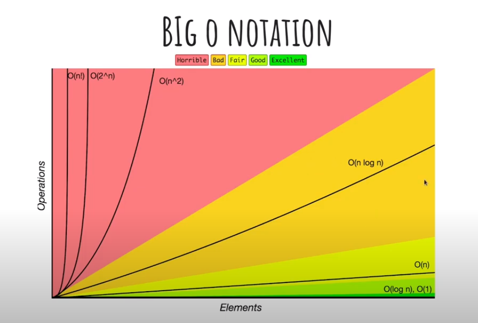

# Big O Notation

A notação Big O é amplamente utilizada para determinar a eficiência de um algoritmo.

É um modelo que classifica o tempo de execução ou espaço ocupado pelo algoritmo à medida que a entrada (n) aumenta.

### Desempenho

- O fatorial (n!) representa o número de instruções executadas, o qual cresce de forma extremamente rápida em relação ao pequeno aumento no número de itens processados. Isso é evidente na implementação ingênua do problema do __caixeiro viajante__ ou de algoritmos que geram todas as permutações possíveis de uma lista.

- A complexidade exponencial de O(2^n) é altamente desfavorável, pois o número de instruções cresce rapidamente, embora em uma taxa menor do que antes. Isso é especialmente problemático em algoritmos que realizam busca em árvores binárias não ordenadas

- A complexidade quadrática, representada por O(n^2), é viável, porém, tende a apresentar um desempenho significativamente inferior quando lidamos com uma quantidade considerável de dados. Isso ocorre especialmente em algoritmos que possuem dois loops aninhados, como no processamento de elementos em uma matriz bidimensional, por exemplo.

- A complexidade O(n log(n)), seja subquadrática ou superlinear, é mais eficiente do que a complexidade quadrática. Um exemplo disso é o algoritmo de ordenação Quick Sort, que tem uma complexidade C(n) de O(n^2) no pior caso e O(n log(n)) no melhor e médio caso.

- A complexidade O(n) (linear) ocorre quando o número de operações de um algoritmo é diretamente proporcional ao número de itens. Isso é observado em algoritmos de busca em uma matriz unidimensional não ordenada.

- O (log n) é um tipo de função cujo crescimento no número de operações é inferior ao número de itens considerados. Isso é particularmente evidente em algoritmos de busca em árvores binárias (Binary Search Trees).

- A complexidade constante (O(1)) é aquela em que o número de operações não cresce, independentemente do volume de dados de entrada (n). Um exemplo disso é o acesso direto a um elemento de uma matriz.
